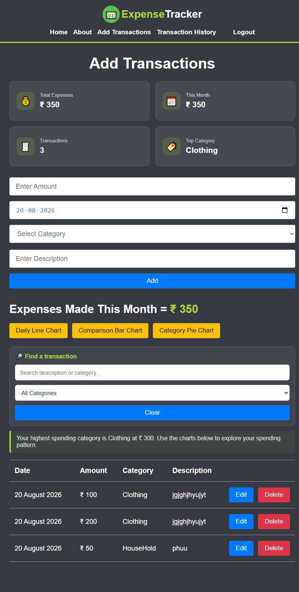
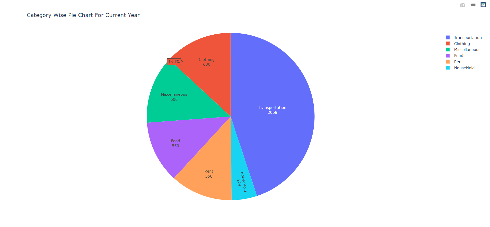
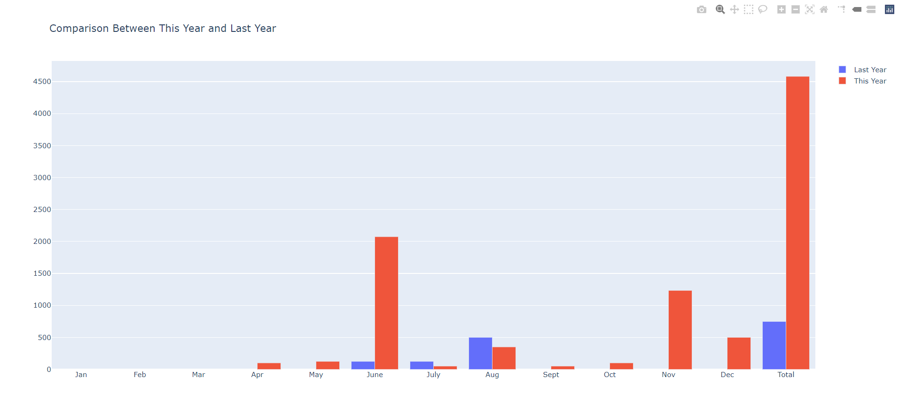

# 📊 Expense-Tracker

> Expense Tracker is a full-stack web application I built to keep track of daily income and expenses.
> I wanted to build something where I could practice working with a React frontend, FastAPI backend, SQLAlchemy, database operations, authentication, and REST APIs in one project.

---

## 📌 Table of Contents
- [✨  Features](#-features)
- [🛠️ Technologies Used](#-Technologies-Used)
- [🏗️ System Architecture](#%EF%B8%8F-system-architecture)
- [🚀 Local Deployment Guide](#-local-deployment-guide)
- 
- [📬 Contact](#-contact)

---

## ✨ Features

- User signup and login
- JWT-based authentication
- Add, edit, and delete transactions
- Track income and expenses
- View total balance
- Organize transactions by category
- Filter transactions by category
- Import transactions from CSV files
- View recent transaction history
- Responsive frontend
- REST API with FastAPI
- SQLite database using SQLAlchemy

---

## 🛠️ Technologies Used

### Backend 
- Python
- FastAPI
- SQLAlchemy
- Pydantic
- JWT
- Passlib

### Frontend
- React.js
- JavaScript
- HTML
- CSS
- Vite

### Database
- SQLite

### Tools
- Git
- GitHub
- Docker
- VS Code
  
---

## 🏗️ System Architecture

```text
 expense-tracker/
│
├── backend/
│    ├── main.py
│    ├── database.py
│    |── models.py
│    ├── seed.py
│    ├── requirements.txt
│    └── Dockerfile
│
├── frontend/
│     ├── src/
│     │    ├── App.jsx
│     │    ├── main.jsx
│     │    └── ...
│     └── package.json
│
└── README.md
```

---

## 🚀 Local Deployment Guide

Follow these steps to spin up the full-stack system natively on your local machine:

### 📋 Prerequisites
Ensure you have the latest stable distribution of **Python 3.12+** installed on your system.

### 🐍 1. Initialize the Backend Core Server
1. Open your terminal or Command Prompt, and navigate to the backend folder path:
   ```bash
   cd d:/expense-tracker/backend
   ```
2. Create an isolated python virtual environment and activate it:
   ```bash
   python -m venv venv
   # On Windows:
   venv\Scripts\activate
   # On Linux/Ubuntu/macOS:
   source venv/bin/activate
   ```
3. Install the application constraints and requirements:
   ```bash
   pip install fastapi uvicorn pydantic[email] sqlalchemy passlib[bcrypt] pyjwt python-multipart
   ```
4. Turn on the background development server engine:
   ```bash
   python -m uvicorn main:app --reload
   ```
   *(Verify the terminal displays: `INFO: Uvicorn running on http://127.0.0.1:8000`)*.

### 🖥️ 2. Host the Responsive UI Client
1. Open a **second, completely separate** terminal or Command Prompt window.
2. Step inside your frontend folder asset directory:
   ```bash
   cd d:/expense-tracker/frontend
   ```
3. Boot up the local HTTP network distribution node:
   ```bash
   python -m http.server 3000
   ```
4. Launch your browser window and navigate to your production interface: **`http://localhost:3000`**

---


## Screenshot Of The Website

<p align="center">Sign Up Page</p>
<p align="center">
 
</p>

<p align="center">Login Page</p>
<p align="center">
 
</p>

<p align="center">Add Transaction Page</p>
<p align="center">
 
</p>


<p align="center">Category Wise Pie Chart For Current Year</p>
<p align="center">
 
</p>

<p align="center">Comparison Between Current Year And Previous Year Transactions</p>
<p align="center">
 
</p>

<p align="center">Daily Line Chart for Current Month</p>
<p align="center">
 
</p>


---

## 📬 Contact
- **Project Repository**: [https://github.com/jhanwi](https://github.com)
- **LinkedIn Profile**: [https://linkedin.com/jhanwi-kumari](https://linkedin.com)
